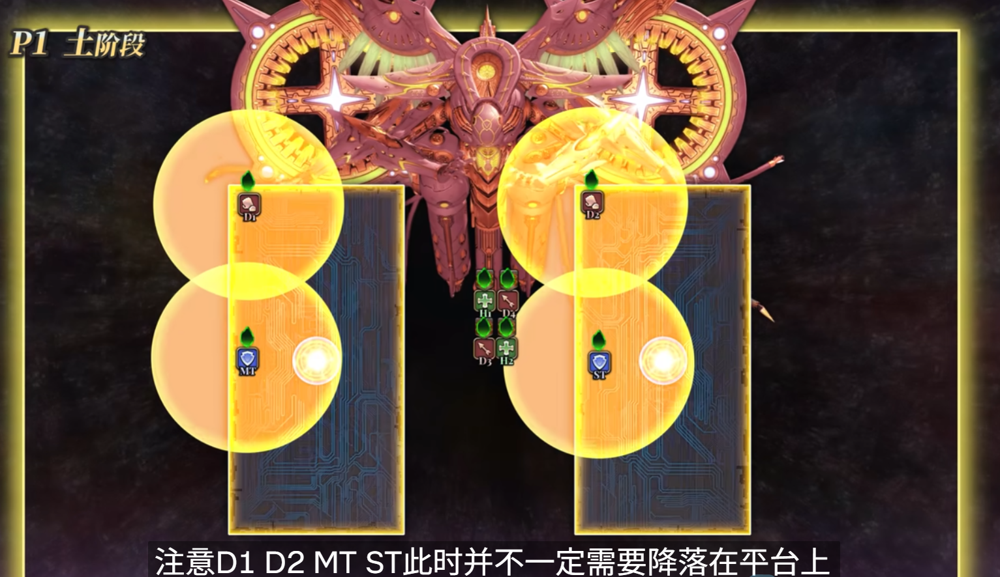
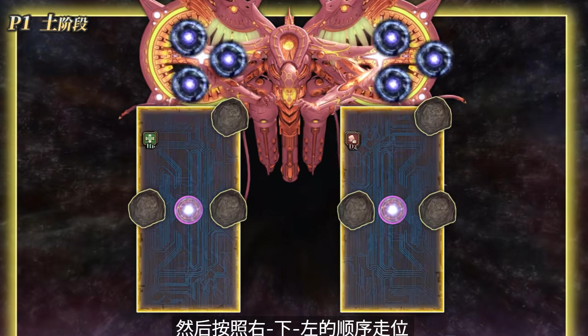
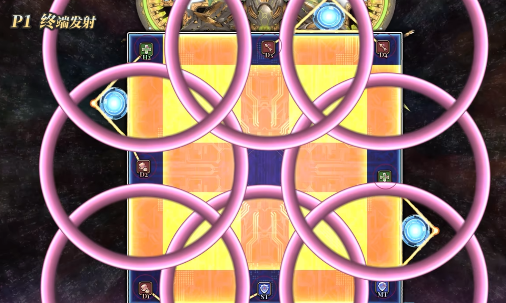
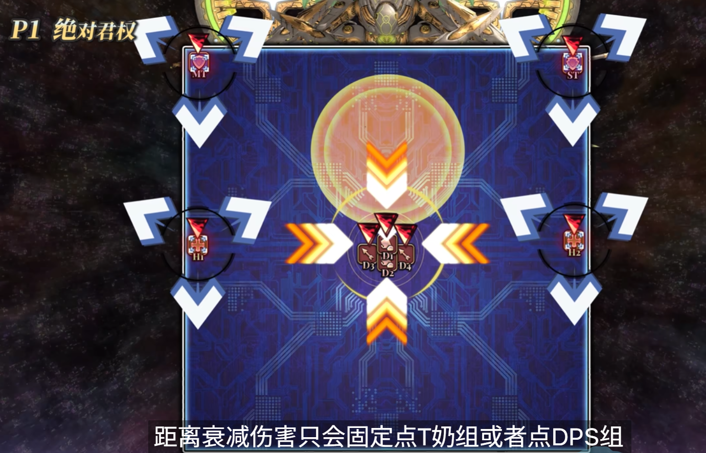
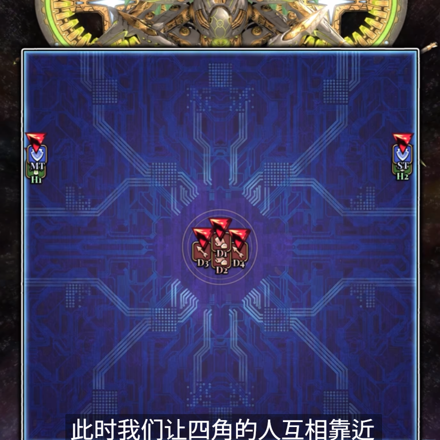
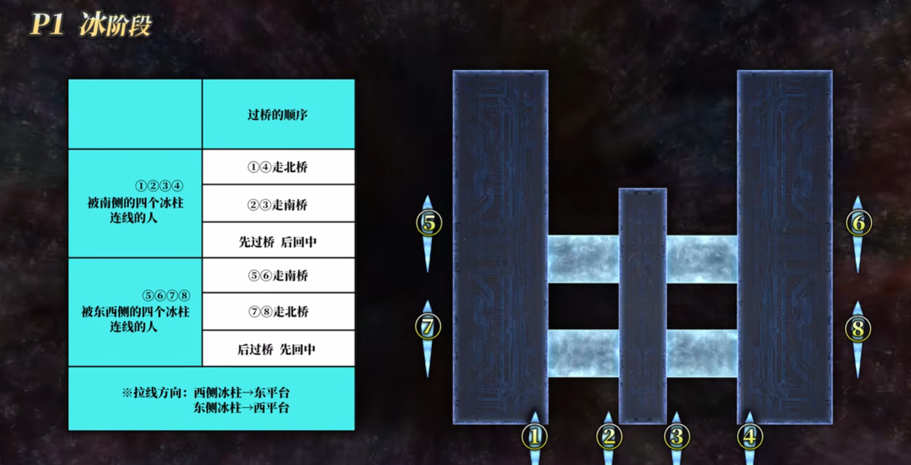
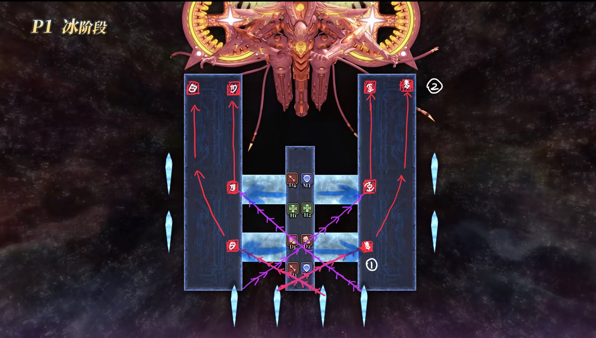
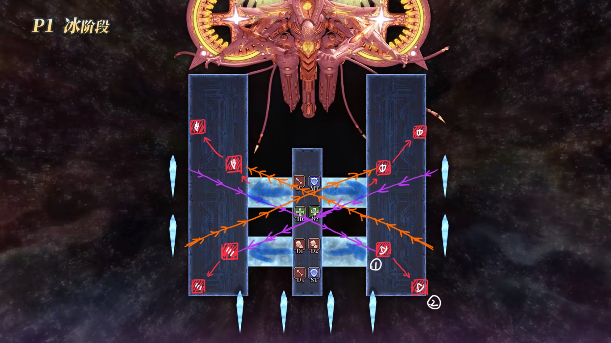
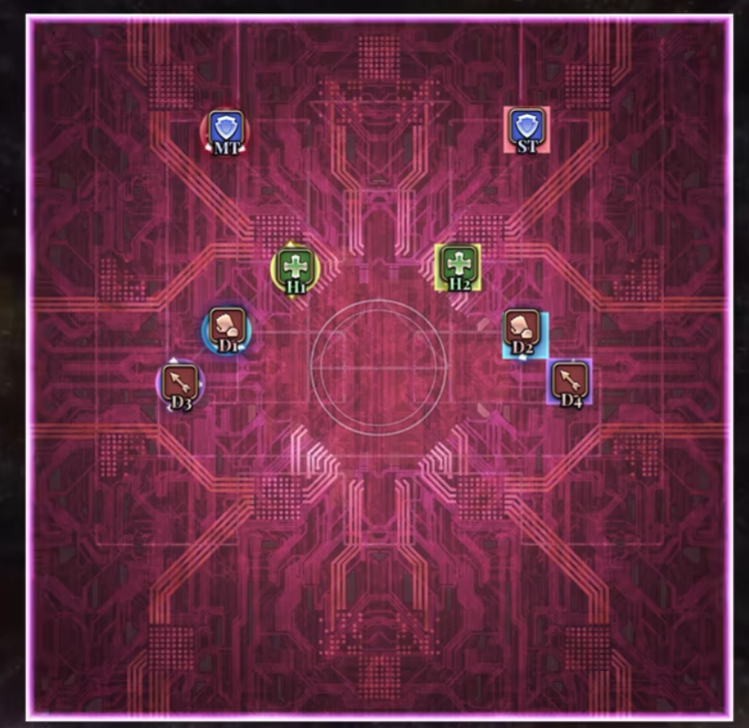
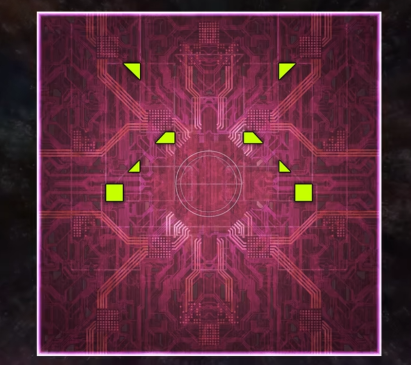

# P1

### 以太税

## 风阶段

### 风之法则 锁链

    
    

### 分治法

## 土阶段

### 踩塔 重力帝国

重力帝国踩塔优先级：D1/2-T-D3/4-N

    
    

### 放置陨石 重力打击

    
    

### 终端发射

###  绝对君权

    
    

## 冰阶段

### 拉线

内下外上，上下下上。

    
    

### 截线分摊

无敌覆盖34轮。

# P2

## 激进切换

    
    

